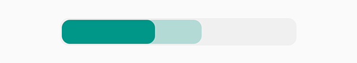
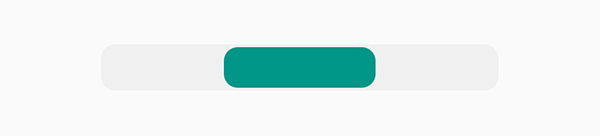
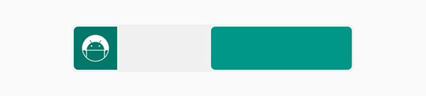
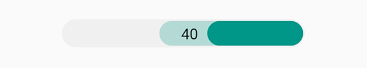
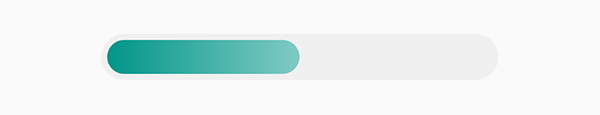
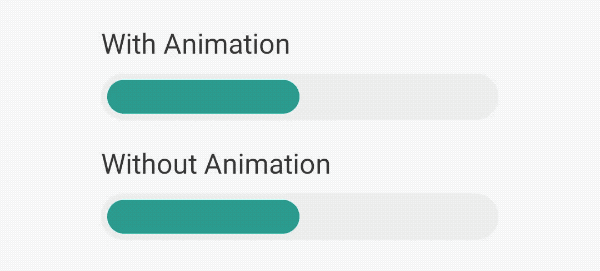

# RoundCornerProgressBar — Android View

The Android View implementation of RoundCornerProgressBar.

See the [project README](../README.md) for the library overview, and the [Jetpack Compose module](../compose/README.md) for the Compose implementation.

# Download

```kotlin
implementation("com.akexorcist:roundcornerprogressbar-view:2.2.2")
```

> Previously published as `com.akexorcist:round-corner-progress-bar`. See [Migration](../README.md#migration) for the artifact rename.

# Usage

For using custom attribute of progress bar, define 'app' namespace as root view attribute in your layout

```xml
xmlns:app="http://schemas.android.com/apk/res-auto"
```

## RoundCornerProgressBar

### Example

```xml
<com.akexorcist.roundcornerprogressbar.RoundCornerProgressBar
    android:layout_width="260dp"
    android:layout_height="30dp"
    app:rcBackgroundColor="#0A000000"
    app:rcBackgroundPadding="2dp"
    app:rcMax="100"
    app:rcProgress="40"
    app:rcProgressColor="#EF5350"
    app:rcRadius="10dp"
    app:rcSecondaryProgress="60"
    app:rcSecondaryProgressColor="#40EF5350" />
```



### Layout XML

```xml
<com.akexorcist.roundcornerprogressbar.RoundCornerProgressBar
    app:rcProgress="float"
    app:rcSecondaryProgress="float"
    app:rcMax="float"
    app:rcRadius="dimension"
    app:rcBackgroundPadding="dimension"
    app:rcReverse="boolean"
    app:rcProgressColor="color"
    app:rcSecondaryProgressColor="color"
    app:rcBackgroundColor="color"
    app:rcAnimationEnable="boolean"
    app:rcAnimationSpeedScale="float" />
```

### Public Methods

```kotlin
// Progress
fun getMax(): Float
fun setMax(max: Float)
fun setMax(max: Int)
fun getProgress(): Float
fun setProgress(progress: Int)
fun setProgress(progress: Float)
fun getSecondaryProgress(): Float
fun setSecondaryProgress(secondaryProgress: Int)
fun setSecondaryProgress(secondaryProgress: Float)

// Dimension
fun getRadius(): Int
fun setRadius(radius: Int)
fun getPadding(): Int
fun setPadding(padding: Int)
fun getLayoutWidth(): Float

// Animation
fun enableAnimation()
fun disableAnimation()
fun getAnimationSpeedScale(): Float
fun setAnimationSpeedScale(scale: Float)
fun isProgressAnimating(): Boolean
fun isSecondaryProgressAnimating(): Boolean

// Reversing Progress
fun isReverse(): Boolean
fun setReverse(isReverse: Boolean)

// Color
fun getProgressBackgroundColor(): Int
fun setProgressBackgroundColor(color: Int)
fun getProgressColor(): Int
fun setProgressColor(color: Int)
fun getProgressColors(): List<Int>
fun setProgressColors(colors: List<Int>)
fun getSecondaryProgressColor(): Int
fun setSecondaryProgressColor(color: Int)
fun getSecondaryProgressColors(): List<Int>
fun setSecondaryProgressColors(colors: List<Int>)

// Listener
fun setOnProgressChangedListener(listener: OnProgressChangedListener)
```

## CenteredRoundCornerProgressBar

Same as RoundCornerProgressBar but reversing does not supported.

### Example

```xml
<com.akexorcist.roundcornerprogressbar.CenteredRoundCornerProgressBar
    android:layout_width="260dp"
    android:layout_height="30dp"
    app:rcBackgroundColor="#0A000000"
    app:rcBackgroundPadding="2dp"
    app:rcMax="100"
    app:rcProgress="40"
    app:rcProgressColor="#EF5350"
    app:rcRadius="10dp"/>
```



### Layout XML

```xml
<com.akexorcist.roundcornerprogressbar.CenteredRoundCornerProgressBar
    app:rcProgress="float"
    app:rcSecondaryProgress="float"
    app:rcMax="float"
    app:rcRadius="dimension"
    app:rcBackgroundPadding="dimension"
    app:rcProgressColor="color"
    app:rcSecondaryProgressColor="color"
    app:rcBackgroundColor="color"
    app:rcAnimationEnable="boolean"
    app:rcAnimationSpeedScale="float" />
```

### Public Methods

```kotlin
// Progress
fun getMax(): Float
fun setMax(max: Float)
fun setMax(max: Int)
fun getProgress(): Float
fun setProgress(progress: Int)
fun setProgress(progress: Float)
fun getSecondaryProgress(): Float
fun setSecondaryProgress(secondaryProgress: Int)
fun setSecondaryProgress(secondaryProgress: Float)

// Dimension
fun getRadius(): Int
fun setRadius(radius: Int)
fun getPadding(): Int
fun setPadding(padding: Int)
fun getLayoutWidth(): Float

// Animation
fun enableAnimation()
fun disableAnimation()
fun getAnimationSpeedScale(): Float
fun setAnimationSpeedScale(scale: Float)
fun isProgressAnimating(): Boolean
fun isSecondaryProgressAnimating(): Boolean

// Color
fun getProgressBackgroundColor(): Int
fun setProgressBackgroundColor(color: Int)
fun getProgressColor(): Int
fun setProgressColor(color: Int)
fun getProgressColors(): List<Int>
fun setProgressColors(colors: List<Int>)
fun getSecondaryProgressColor(): Int
fun setSecondaryProgressColor(color: Int)
fun getSecondaryProgressColors(): List<Int>
fun setSecondaryProgressColors(colors: List<Int>)

// Listener
fun setOnProgressChangedListener(listener: OnProgressChangedListener)
```

## IconRoundCornerProgressBar

Icon size is required for this progress bar. Use `wrap_content` for `layout_height` is recommended.

```xml
<com.akexorcist.roundcornerprogressbar.IconRoundCornerProgressBar
        android:layout_height="wrap_content"
        app:rcIconSize="40dp"
        ... />
```

### Example

```xml
<com.akexorcist.roundcornerprogressbar.IconRoundCornerProgressBar
    android:layout_width="260dp"
    android:layout_height="wrap_content"
    app:rcBackgroundColor="#0A000000"
    app:rcBackgroundPadding="2dp"
    app:rcIconBackgroundColor="#00796B"
    app:rcIconPadding="5dp"
    app:rcIconSize="40dp"
    app:rcIconSrc="@drawable/ic_android"
    app:rcMax="150"
    app:rcProgress="90"
    app:rcProgressColor="#EF5350"
    app:rcRadius="5dp"
    app:rcReverse="true" />
```



### Layout XML

```xml
<com.akexorcist.roundcornerprogressbar.IconRoundCornerProgressBar
        app:rcProgress="float"
        app:rcSecondaryProgress="float"
        app:rcMax="float"
        app:rcRadius="dimension"
        app:rcBackgroundPadding="dimension"
        app:rcReverse="boolean"
        app:rcProgressColor="color"
        app:rcSecondaryProgressColor="color"
        app:rcBackgroundColor="color"
        app:rcAnimationEnable="boolean"
        app:rcAnimationSpeedScale="float"
        app:rcIconSrc="reference"
        app:rcIconSize="dimension"
        app:rcIconWidth="dimension"
        app:rcIconHeight="dimension"
        app:rcIconPadding="dimension"
        app:rcIconPaddingLeft="dimension"
        app:rcIconPaddingRight="dimension"
        app:rcIconPaddingTop="dimension"
        app:rcIconPaddingBottom="dimension"
        app:rcIconBackgroundColor="color" />
```

### Public Methods

```kotlin
// Progress
fun getMax(): Float
fun setMax(max: Float)
fun setMax(max: Int)
fun getProgress(): Float
fun setProgress(progress: Int)
fun setProgress(progress: Float)
fun getSecondaryProgress(): Float
fun setSecondaryProgress(secondaryProgress: Int)
fun setSecondaryProgress(secondaryProgress: Float)

// Dimension
fun getRadius(): Int
fun setRadius(radius: Int)
fun getPadding(): Int
fun setPadding(padding: Int)
fun getLayoutWidth(): Float

fun getIconSize(): Int
fun setIconSize(size: Int)
fun getIconPadding(): Int
fun setIconPadding(padding: Int)
fun getIconPaddingLeft(): Int
fun setIconPaddingLeft(padding: Int)
fun getIconPaddingTop(): Int
fun setIconPaddingTop(padding: Int)
fun getIconPaddingRight(): Int
fun setIconPaddingRight(padding: Int)
fun getIconPaddingBottom(): Int
fun setIconPaddingBottom(padding: Int)

// Animation
fun enableAnimation()
fun disableAnimation()
fun getAnimationSpeedScale(): Float
fun setAnimationSpeedScale(scale: Float)
fun isProgressAnimating(): Boolean
fun isSecondaryProgressAnimating(): Boolean

// Reversing Progress
fun isReverse(): Boolean
fun setReverse(isReverse: Boolean)

// Color
fun getProgressBackgroundColor(): Int
fun setProgressBackgroundColor(color: Int)
fun getProgressColor(): Int
fun setProgressColor(color: Int)
fun getProgressColors(): List<Int>
fun setProgressColors(colors: List<Int>)
fun getSecondaryProgressColor(): Int
fun setSecondaryProgressColor(color: Int)
fun getSecondaryProgressColors(): List<Int>
fun setSecondaryProgressColors(colors: List<Int>)
fun getColorIconBackground(): Int
fun setIconBackgroundColor(color: Int)

// Icon
fun getIconImageResource(): Int
fun setIconImageResource(resId: Int)
fun getIconImageBitmap(): Birmap
fun setIconImageBitmap(bitmap: Bitmap)
fun getIconImageDrawable(): Drawable
fun setIconImageDrawable(drawable: Drawable)

// Listener
fun setOnProgressChangedListener(listener: OnProgressChangedListener)
fun setOnIconClickListener(listener: OnIconClickListener)
```

## TextRoundCornerProgressBar

### Example

```xml
<com.akexorcist.roundcornerprogressbar.TextRoundCornerProgressBar
    android:layout_width="260dp"
    android:layout_height="30dp"
    app:rcBackgroundColor="#0A000000"
    app:rcBackgroundPadding="2dp"
    app:rcMax="100"
    app:rcProgress="40"
    app:rcProgressColor="#EF5350"
    app:rcRadius="80dp"
    app:rcReverse="true"
    app:rcSecondaryProgress="60"
    app:rcSecondaryProgressColor="#40009688"
    app:rcTextPositionPriority="outside"
    app:rcTextProgress="40"
    app:rcTextProgressColor="#111111" />
```



### Layout XML

```xml
<com.akexorcist.roundcornerprogressbar.TextRoundCornerProgressBar
        app:rcProgress="float"
        app:rcSecondaryProgress="float"
        app:rcMax="float"
        app:rcRadius="dimension"
        app:rcBackgroundPadding="dimension"
        app:rcReverse="boolean"
        app:rcProgressColor="color"
        app:rcSecondaryProgressColor="color"
        app:rcBackgroundColor="color"
        app:rcAnimationEnable="boolean"
        app:rcAnimationSpeedScale="float"
        app:rcTextProgressColor="color"
        app:rcTextProgressSize="dimension"
        app:rcTextProgressMargin="dimension"
        app:rcTextProgress="String"
        app:rcTextInsideGravity="start|end"
        app:rcTextOutsideGravity="start|end"
        app:rcTextPositionPriority="inside|outside" />
```

### Public Methods

```kotlin
// Progress
fun getMax(): Float
fun setMax(max: Float)
fun setMax(max: Int)
fun getProgress(): Float
fun setProgress(progress: Int)
fun setProgress(progress: Float)
fun getSecondaryProgress(): Float
fun setSecondaryProgress(secondaryProgress: Int)
fun setSecondaryProgress(secondaryProgress: Float)

// Dimension
fun getRadius(): Int
fun setRadius(radius: Int)
fun getPadding(): Int
fun setPadding(padding: Int)
fun getLayoutWidth(): Float
fun getTextProgressSize(): Int
fun setTextProgressSize(size: Int)
fun getTextProgressMargin(): Int
fun setTextProgressMargin(margin: Int)

// Animation
fun enableAnimation()
fun disableAnimation()
fun getAnimationSpeedScale(): Float
fun setAnimationSpeedScale(scale: Float)
fun isProgressAnimating(): Boolean
fun isSecondaryProgressAnimating(): Boolean

// Reversing Progress
fun isReverse(): Boolean
fun setReverse(isReverse: Boolean)

// Color
fun getProgressBackgroundColor(): Int
fun setProgressBackgroundColor(color: Int)
fun getProgressColor(): Int
fun setProgressColor(color: Int)
fun getProgressColors(): List<Int>
fun setProgressColors(colors: List<Int>)
fun getSecondaryProgressColor(): Int
fun setSecondaryProgressColor(color: Int)
fun getSecondaryProgressColors(): List<Int>
fun setSecondaryProgressColors(colors: List<Int>)
fun getTextProgressColor(): Int
fun setTextProgressColor(color: Int)

// Text
fun getProgressText(): String
fun setProgressText(text: String)

// Position
fun getTextPositionPriority(): Int
fun setTextPositionPriority(priority: Int)
fun getTextInsideGravity(): Int
fun setTextInsideGravity(gravity: Int)
fun getTextOutsideGravity(): Int
fun setTextOutsideGravity(gravity: Int)

// Listener
fun setOnProgressChangedListener(listener: OnProgressChangedListener)
```

## IndeterminateRoundCornerProgressBar

### Example

```xml
<com.akexorcist.roundcornerprogressbar.indeterminate.IndeterminateRoundCornerProgressBar
    android:layout_width="260dp"
    android:layout_height="10dp"
    app:rcAnimationSpeedScale="3"
    app:rcBackgroundColor="#0A000000"
    app:rcProgressColor="#EF5350" />
```


### Layout XML

```xml
<com.akexorcist.roundcornerprogressbar.indeterminate.IndeterminateRoundCornerProgressBar
        app:rcRadius="dimension"
        app:rcBackgroundPadding="dimension"
        app:rcReverse="boolean"
        app:rcProgressColor="color"
        app:rcSecondaryProgressColor="color"
        app:rcBackgroundColor="color"
        app:rcAnimationSpeedScale="float" />
```

### Public Methods

```kotlin
// Dimension
fun getRadius(): Int
fun setRadius(radius: Int)
fun getPadding(): Int
fun setPadding(padding: Int)
fun getLayoutWidth(): Float

// Animation
fun getAnimationSpeedScale(): Float
fun setAnimationSpeedScale(scale: Float)

// Reversing Progress
fun isReverse(): Boolean
fun setReverse(isReverse: Boolean)

// Color
fun getProgressBackgroundColor(): Int
fun setProgressBackgroundColor(color: Int)
fun getProgressColor(): Int
fun setProgressColor(color: Int)
fun getProgressColors(): List<Int>
fun setProgressColors(colors: List<Int>)
fun getSecondaryProgressColor(): Int
fun setSecondaryProgressColor(color: Int)
fun getSecondaryProgressColors(): List<Int>
fun setSecondaryProgressColors(colors: List<Int>)
```

## IndeterminateCenteredRoundCornerProgressBar

Same as IndeterminateRoundCornerProgressBar

### Example

```xml
<com.akexorcist.roundcornerprogressbar.indeterminate.IndeterminateCenteredRoundCornerProgressBar
    android:layout_width="260dp"
    android:layout_height="10dp"
    app:rcAnimationSpeedScale="0.75"
    app:rcBackgroundColor="#0A000000"
    app:rcProgressColor="#EF5350" />
```


### Layout XML

```xml
<com.akexorcist.roundcornerprogressbar.IndeterminateCenteredRoundCornerProgressBar
        app:rcRadius="dimension"
        app:rcBackgroundPadding="dimension"
        app:rcReverse="boolean"
        app:rcProgressColor="color"
        app:rcSecondaryProgressColor="color"
        app:rcBackgroundColor="color"
        app:rcAnimationSpeedScale="float" />
```

### Public Methods

```kotlin
// Dimension
fun getRadius(): Int
fun setRadius(radius: Int)
fun getPadding(): Int
fun setPadding(padding: Int)
fun getLayoutWidth(): Float

// Animation
fun getAnimationSpeedScale(): Float
fun setAnimationSpeedScale(scale: Float)

// Reversing Progress
fun isReverse(): Boolean
fun setReverse(isReverse: Boolean)

// Color
fun getProgressBackgroundColor(): Int
fun setProgressBackgroundColor(color: Int)
fun getProgressColor(): Int
fun setProgressColor(color: Int)
fun getProgressColors(): List<Int>
fun setProgressColors(colors: List<Int>)
fun getSecondaryProgressColor(): Int
fun setSecondaryProgressColor(color: Int)
fun getSecondaryProgressColors(): List<Int>
fun setSecondaryProgressColors(colors: List<Int>)
```

## Apply Gradient Progress Bar Color

Gradient color for progress bar must be in int array resource. At least 2 colors.

```xml
<!-- Color Resource -->
<resources>
    <array name="sample_progress_gradient">
        <item>#009688</item>
        <item>#80CBC4</item>
    </array>
</resources>

<!-- Layout -->
<com.akexorcist.roundcornerprogressbar.RoundCornerProgressBar
    ...
    app:rcBackgroundColor="#0A000000"
    app:rcBackgroundPadding="4dp"
    app:rcMax="100"
    app:rcProgress="50"
    app:rcProgressColors="@array/sample_progress_gradient"
    app:rcRadius="30dp" />
```



Progress bar does not clipped when size changed. So the gradient color will fully display without clipping also.

## Apply Progress Change Animation

Animation when progress change is disabled by default (exclude `IndeterminateProgressBar` and `IndeterminateCenteredProgressBar`).

So you have to enable the animation by XML attribute or programmatically

```xml
<com.akexorcist.roundcornerprogressbar.RoundCornerProgressBar
    ...
    app:rcAnimationEnable="true"
    app:rcAnimationSpeedScale="1" />

```

When progress changed, the animation will applied automatically.



Animation speed scale's value is float between 0.2 - 5.0 (default is 1.0). Higher for slow down the animation, lower for speed up.

# What's Next

- IconTextRoundCornerProgressBar ([#69](https://github.com/akexorcist/Android-RoundCornerProgressBar/pull/69))
- UI Preview improvement

# Known Issues

- Incorrect progress showing in `CenteredRoundCornerProgressBar` with 1%-2% value
- Incorrect text's width in `TextRoundCornerProgressBar` when `outside` priority and value close to 100%
- `setProgress(progress: Int)` does not update text position
